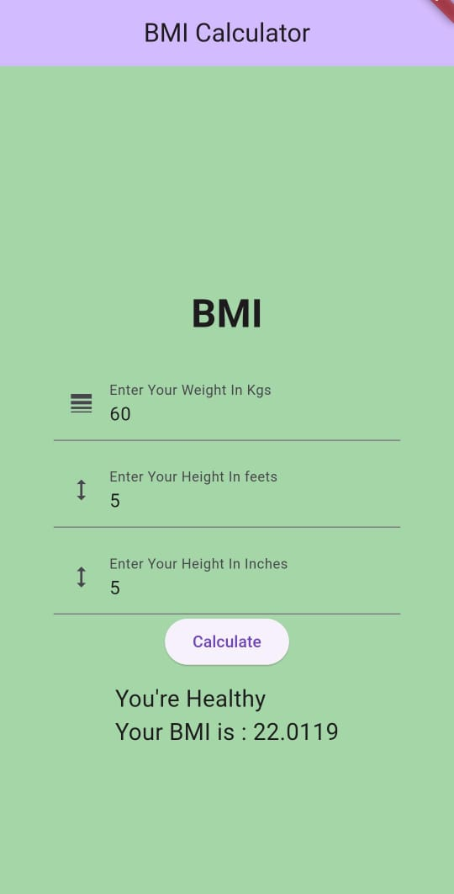

# BMI Calculator

BMI Calculator is a simple Flutter application that helps users calculate their Body Mass Index (BMI) based on their weight and height. 

## Features

- Calculate BMI: Users can input their weight and height, and the app will calculate their BMI.
- BMI Categories: Based on the calculated BMI, users are provided with their BMI category (Underweight, Normal weight, Overweight, or Obese) along with some general advice.
- Clean Interface: The app has a simple and intuitive user interface, making it easy for users to input their information and get instant results.

## Screenshots



## Installation

To run this application, you need to have Flutter installed. If you haven't installed Flutter yet, you can follow the instructions on the [official Flutter website](https://flutter.dev/docs/get-started/install).

1. Clone this repository to your local machine:

```
git clone https://github.com/maheshsathe07/BMI_Calculator.git
```

2. Navigate to the project directory:

```
cd BMI_Calculator
```

3. Run the app:

```
flutter run
```

## License

This project is licensed under the MIT License - see the [LICENSE](LICENSE) file for details.
